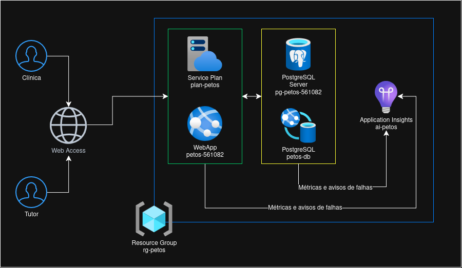

# 🐾 PetOS Challenge — Cuidado veterinário e prevenção

> Aplicação web da 3ª Sprint de Java Advanced: Java 21, Spring Boot, Spring MVC, Thymeleaf, Spring Security e Flyway. As páginas e a API REST são servidas pelo mesmo projeto, sem servidor Node/Vite.

---

## 📋 Descrição da Solução

O PetOS é uma aplicação web (Java 21 + Spring Boot) que centraliza o histórico de saúde, vacinas, rotinas e alertas dos pets, permitindo que tutores e clínicas veterinárias acompanhem a saúde dos animais de forma longitudinal, com notificações automáticas de vacinas vencidas ou próximas do vencimento. A UI (Thymeleaf) e a API REST (JWT) são servidas pelo mesmo projeto, publicado em nuvem na Azure com banco de dados PostgreSQL também em nuvem.

## 💼 Benefícios para o Negócio

- **Reduz vacinas esquecidas/atrasadas:** o sistema calcula automaticamente o status de cada vacina (`PENDING`, `APPLIED`, `EXPIRING_SOON`, `OVERDUE`) e gera alertas preventivos, eliminando o controle manual em planilhas ou papel.
- **Centraliza o histórico do pet:** vacinas, rotinas (passeios, alimentação, banho, consultas) e alertas ficam reunidos numa única timeline por pet, em vez de espalhados entre clínica e tutor.
- **Separa responsabilidades por papel:** tutores acompanham apenas seus próprios pets ativos; clínicas registram e mantêm as vacinas de todos os pets — refletindo a divisão real de responsabilidades entre quem cuida do pet no dia a dia e quem presta o serviço veterinário.
- **Rastreabilidade:** cada alerta preventivo fica vinculado à vacina que o originou, evitando duplicidade de notificações e permitindo auditar por que um alerta foi disparado.

---

## 🏗️ Arquitetura



```
project/
└── src/main/java/br/com/petos/project/
    ├── config/          → Segurança, Swagger e configurações
    ├── controller/      → Endpoints REST (HTTP layer)
    ├── web/             → Controllers MVC, formulários e apresentação
    ├── security/        → Autenticação e política de acesso
    ├── domain/          → Política de vacinação
    ├── service/         → Regras de negócio
    ├── repository/      → Acesso a dados (Spring Data JPA)
    ├── entity/          → Entidades JPA mapeadas
    ├── dto/             → Request/Response DTOs
    ├── mapper/          → Conversão Entity ↔ DTO
    ├── enums/           → Enumerações do domínio
    └── exception/       → Tratamento global de erros
```

As views ficam em `project/src/main/resources/templates/` (login, cadastro, home, vacinação e histórico). CSS, JavaScript e ilustrações locais ficam em `static/`. As migrations ficam em `db/migration/`.

---

## 🚀 Tecnologias

| Tecnologia | Versão |
|---|---|
| Java | 21 |
| Spring Boot | 3.4.4 |
| Spring Web / MVC + Thymeleaf | — |
| Spring Security + JWT (API) | — |
| Flyway | — |
| Spring Data JPA | — |
| Bean Validation | — |
| H2 Database (local/testes) | — |
| PostgreSQL (produção, Azure Database for PostgreSQL Flexible Server) | 16 |
| SpringDoc OpenAPI | 2.8.6 |
| Lombok | 1.18.38 |
| Maven | 3.x |

---

## ☁️ Deploy no Azure

A aplicação roda em produção 100% na nuvem, conforme exigido pela disciplina: **Azure App Service (Linux, Java 21, tier F1)** + **Azure Database for PostgreSQL Flexible Server**, nada executado localmente.

### Provisionamento

O script `azure-setup.sh` (raiz deste repositório) cria toda a infraestrutura via Azure CLI:
- Resource Group
- Servidor PostgreSQL Flexible Server (`Standard_B1ms`, Burstable, acesso público liberado para a assinatura de estudante)
- Banco de dados `petosdb`
- Application Insights (telemetria/monitoramento)
- App Service Plan (Linux, F1)
- Web App (runtime `JAVA|21-java21`)
- App Settings do Web App com as credenciais do banco e os segredos da aplicação
- Integração CI/CD com GitHub Actions (`az webapp deployment github-actions add`)

Para recriar o ambiente do zero: `chmod +x azure-setup.sh && ./azure-setup.sh`. Para derrubar tudo e não gastar créditos: `./azure-delete.sh`.

### CI/CD (GitHub Actions)

O workflow em `.github/workflows/` builda e publica a cada push na `main`:
1. Checkout do repositório
2. Setup do JDK 21 (Temurin)
3. `mvn clean install` com `working-directory: project` (o `pom.xml` não está na raiz do repo, está em `project/`)
4. Deploy do jar gerado (`project/target/*.jar`) para o Web App via `azure/webapps-deploy`, usando o publish profile como secret

O passo de build **não** recebe as credenciais de banco via GitHub Secrets — os testes usam o profile `test` com H2 em memória (`application-test.properties`), e as credenciais reais de produção só existem como App Settings do Web App, aplicadas em runtime.

### Variáveis em produção (App Settings do Web App)

Além das variáveis já listadas em [Configuração e banco](#configuração-e-banco), o Web App tem:

| Variável | Origem |
|---|---|
| `SPRING_DATASOURCE_URL` | `jdbc:postgresql://<servidor>.postgres.database.azure.com:5432/petosdb?sslmode=require` |
| `APPINSIGHTS_CONNECTIONSTRING` / `APPLICATIONINSIGHTS_CONNECTION_STRING` / `ApplicationInsightsAgent_EXTENSION_VERSION` / `XDT_MicrosoftApplicationInsights_Mode` / `XDT_MicrosoftApplicationInsights_PreemptSdk` | Geradas automaticamente ao conectar o Application Insights ao Web App; não editar manualmente |

### Conectando ao banco pelo VS Code

Para rodar scripts `.sql` direto contra o Postgres do Azure, use a extensão **PostgreSQL** da Microsoft (`ms-ossdata.vscode-pgsql`) — não a extensão **SQL Server (mssql)**, que fala um protocolo diferente e não conecta. Dados de conexão: host e porta do servidor Postgres, banco `petosdb`, usuário/senha definidos em `PG_ADMIN_USER`/`PG_ADMIN_PASSWORD` no `azure-setup.sh`, SSL mode `Require`.

### Testando a API autenticada (Postman)

1. `POST /auth/login` com `{"email": "...", "password": "..."}` → a resposta traz `token` (JWT) e `tokenType: Bearer`.
2. Nas demais requisições, use a aba **Authorization → Bearer Token** do Postman com esse token (equivale ao header `Authorization: Bearer <token>`).
3. Sem usuário ainda? Use `POST /auth/register` primeiro — já devolve o token, sem precisar logar depois.

### Acesso, login e perfis

- Aplicação: **https://petos-561082.azurewebsites.net**; login: **https://petos-561082.azurewebsites.net/login**.
- Cadastro: **https://petos-561082.azurewebsites.net/cadastro**. Após cadastrar, entre com e-mail e senha.
- No profile `dev` (padrão), existem contas de demonstração: `tutor@petos.local` e `clinica@petos.local`. São exclusivas para desenvolvimento local.
- Após login, o usuário retorna à página protegida solicitada ou segue para `/web`. O botão **Sair** encerra a sessão.
- **TUTOR:** cadastra pets, consulta somente seus pets ativos, registra rotinas e acompanha vacinação e histórico.
- **CLINICA:** consulta pets ativos de todos os tutores e registra, atualiza e exclui vacinas. Não cadastra pets. Não existe vínculo individual Clínica–Pet no modelo atual.
- A regra atual mantém a escrita de vacinas restrita à CLINICA; esta integração não altera permissões de negócio.

A proteção é feita no servidor por Spring Security e pelos services com ownership. As páginas usam sessão e CSRF; a API continua usando JWT Bearer, sem aceitar a sessão web como autenticação. Para Swagger, obtenha um token em `POST /auth/login` e use **Authorize**. `POST /auth/register` e `GET /auth/me` completam o contrato de autenticação REST.

---

## ▶️ Como rodar localmente

### Pré-requisitos
- JDK 21, com `JAVA_HOME` apontando para a instalação e `%JAVA_HOME%\bin` no `PATH`.
- Internet na primeira execução para baixar o Maven e as dependências.
- Maven global não é obrigatório: use o Wrapper incluído em `project/`.

### Rodando localmente no Windows (PowerShell)

Execute a partir da raiz deste repositório:

```powershell
Set-Location .\project
java -version
.\mvnw.cmd -version
.\mvnw.cmd -B clean verify
.\mvnw.cmd spring-boot:run
```

No Linux/macOS, use `./mvnw` no lugar de `.\mvnw.cmd`. Se preferir o Maven Daemon já instalado, `mvnd clean compile` deve ser executado dentro de `project/`, também com JDK 21. `compile` não executa testes; `clean verify` testa e empacota.

Após o build, também é possível iniciar com `java -jar target/petos-challenge-1.0.0.jar`. Não é necessário instalar npm nem iniciar outro frontend.

### Configuração e banco

| Variável | Comportamento                                                                                                                                                |
|---|--------------------------------------------------------------------------------------------------------------------------------------------------------------|
| `SPRING_PROFILES_ACTIVE` | Padrão `dev`; habilita dados de demonstração e console H2 local.                                                                                             |
| `SERVER_PORT` | Padrão `8080`.                                                                                                                                               |
| `SPRING_DATASOURCE_URL` | Padrão H2 em memória: `jdbc:h2:mem:petosdb`.                                                                        |
| `SPRING_DATASOURCE_USERNAME` / `SPRING_DATASOURCE_PASSWORD` | Padrão `sa` / senha protegida, somente para ambiente local.                                                                                                  |
| `PETOS_DEV_SEED_PASSWORD` | Senha das contas de demonstração na criação. Alterá-la não redefine contas já persistidas.                                                                   |
| `PETOS_JWT_SECRET` | Segredo aleatório de pelo menos 32 caracteres, fornecido externamente. Sem configuração, uma chave efêmera é gerada e tokens deixam de valer após reiniciar. |
| `PETOS_JWT_EXPIRATION_MINUTES` | Validade do token da API, padrão `120`.                                                                                                                      |
| `PETOS_CORS_ALLOWED_ORIGINS` | Origens explícitas da API. A UI integrada funciona na mesma origem e não depende de portas de frontend externo.                                              |

No PowerShell, configure variáveis com `$env:NOME = 'valor'` antes de iniciar a aplicação. Não versione segredos. Para guardar dados entre reinícios locais, use `$env:SPRING_DATASOURCE_URL = 'jdbc:h2:file:./data/petosdb;DB_CLOSE_ON_EXIT=FALSE'`, executando sempre a partir de `project/`. No modo em memória, os dados são perdidos ao encerrar a JVM.

O DDL completo, com comentários em cada tabela e coluna, está consolidado em [`script_bd.sql`](./script_bd.sql), na raiz do repositório (arquivo de documentação/entrega — quem sobe a aplicação não precisa executá-lo manualmente, o Flyway já aplica tudo).

O Flyway executa automaticamente ao iniciar:

1. `V1__create_initial_schema.sql`: estrutura inicial do domínio.
2. `V2__create_users_and_pet_ownership.sql`: usuários e propriedade dos pets.
3. `V3__link_alert_to_vaccine.sql`: associação do alerta à vacina.

O profile `dev` também carrega `db/dev`. O histórico fica em `flyway_schema_history`; uma segunda inicialização não reaplica migrations versionadas já concluídas. O Hibernate apenas valida o schema (`ddl-auto=validate`), e `data.sql` não é executado. Não apague tabelas nem altere migrations aplicadas para contornar falhas de validação.

### Fluxos na interface

**Vacinação preventiva:** entre como CLINICA → selecione um pet → abra **Vacinação preventiva** → registre uma dose pendente com vencimento nos próximos 30 dias → salve. O backend avalia a situação e sincroniza o alerta preventivo, exibido na caderneta. Ao atualizar a dose com data de aplicação, o alerta pendente é resolvido. O TUTOR acompanha esses resultados no próprio pet. A prevenção de duplicidade é feita pelo service/query, não por uma constraint UNIQUE; concorrência simultânea permanece uma limitação.

**Histórico consolidado:** selecione um pet → abra **Histórico consolidado** → consulte a timeline real de vacinas, rotinas e alertas, com filtro por categoria. Registre uma rotina (como consulta veterinária) e retorne ao histórico para acompanhar o novo registro. Pets inativos e dados de outros tutores respeitam as restrições do backend.

Os formulários combinam validações HTML com Bean Validation e regras de service, exibindo erros de campo, erros de negócio e mensagens de sucesso. As páginas também contemplam ausência de dados e acesso negado.

### Testes

`.\mvnw.cmd -B clean verify` executa testes unitários, de repositório e de integração, incluindo renderização Thymeleaf, login/logout, CSRF, os dois perfis, ownership, vacinação preventiva, histórico e validações. Não há etapa de lint Node/npm; não existe frontend Node independente.

---

## 📌 Rotas principais

### 🐶 Pets
| Método | Endpoint | Descrição |
|---|---|---|
| GET | `/pets` | Listar pets ativos (paginado) |
| GET | `/pets/{id}` | Buscar pet por ID |
| GET | `/pets/search?name=` | Buscar por nome |
| GET | `/pets/species/{species}` | Filtrar por espécie |
| GET | `/pets/{id}/history` | Histórico consolidado do pet |
| GET | `/pets/vaccines/expiring` | Pets com vacinas vencidas/próximas |
| POST | `/pets` | Cadastrar pet |
| PUT | `/pets/{id}` | Atualizar pet |
| DELETE | `/pets/{id}` | Inativar pet (soft delete) |

### 💉 Vacinas
| Método | Endpoint | Descrição |
|---|---|---|
| GET | `/vaccines` | Listar todas (paginado) |
| GET | `/vaccines/{id}` | Buscar por ID |
| GET | `/pets/{petId}/vaccines` | Vacinas do pet |
| GET | `/pets/{petId}/vaccines/pending` | Vacinas pendentes do pet |
| POST | `/vaccines` | Registrar vacina (gera alerta automático) |
| PUT | `/vaccines/{id}` | Atualizar vacina |
| DELETE | `/vaccines/{id}` | Remover vacina |

### 📅 Rotinas
| Método | Endpoint | Descrição |
|---|---|---|
| GET | `/routines` | Listar todas (paginado) |
| GET | `/routines/{id}` | Buscar por ID |
| GET | `/pets/{petId}/routines` | Rotinas do pet |
| POST | `/routines` | Registrar rotina |
| PUT | `/routines/{id}` | Atualizar rotina |
| DELETE | `/routines/{id}` | Remover rotina |

### 🔔 Alertas
| Método | Endpoint | Descrição |
|---|---|---|
| GET | `/alerts` | Listar todos (paginado) |
| GET | `/alerts/{id}` | Buscar por ID |
| GET | `/alerts/pending` | Todos os alertas pendentes |
| GET | `/pets/{petId}/alerts` | Alertas do pet |
| GET | `/pets/{petId}/alerts/pending` | Alertas pendentes do pet |
| POST | `/alerts` | Criar alerta manual |
| PUT | `/alerts/{id}` | Atualizar alerta |
| PATCH | `/alerts/{id}/mark-sent` | Marcar alerta como enviado |
| DELETE | `/alerts/{id}` | Remover alerta |

---

## 📖 Swagger / OpenAPI

Após subir a aplicação, acesse:

- **Swagger UI:** [https://petos-561082.azurewebsites.net/swagger-ui/index.html](http://localhost:8080/swagger-ui.html)
- **API Docs (JSON):** [https://petos-561082.azurewebsites.net/api-docs](http://localhost:8080/api-docs)

---

## 🗄️ H2 Console (somente ambiente local)

> ⚠️ O H2 é usado **apenas** para desenvolvimento local e para os testes automatizados (`application-test.properties`). O ambiente publicado no Azure usa exclusivamente **PostgreSQL** (`SPRING_DATASOURCE_URL` sobrescrito nas App Settings do Web App) — o H2 nunca é o banco de dados da aplicação em produção.

Disponível somente com o profile `dev`, rodando localmente:

- **URL:** [http://localhost:8080/h2-console](http://localhost:8080/h2-console)
- **JDBC URL:** a mesma configurada em `SPRING_DATASOURCE_URL` (por padrão `jdbc:h2:mem:petosdb`)
- **Usuário:** `sa`
- **Senha:** *(protegida)*

---

## 🧠 Regras de negócio

- Vacinas não aplicadas vencidas ou com vencimento nos próximos 30 dias geram alerta preventivo; datas futuras fora dessa janela não geram alerta imediato. A avaliação ocorre ao registrar/atualizar a vacina, não por envio automático de e-mail.
- O status da vacina é calculado automaticamente: `PENDING`, `APPLIED`, `EXPIRING_SOON`, `OVERDUE`
- Pets são removidos com **soft delete** (campo `active = false`)
- Histórico consolidado retorna vacinas + rotinas + alertas do pet em uma única chamada

---

## 📦 Enums disponíveis

- **Species:** `DOG`, `CAT`, `BIRD`, `RABBIT`, `FISH`, `REPTILE`, `OTHER`
- **VaccineStatus:** `PENDING`, `APPLIED`, `EXPIRING_SOON`, `OVERDUE`
- **RoutineType:** `WALK`, `FEEDING`, `MEDICATION`, `BATHING`, `GROOMING`, `VET_VISIT`, `TRAINING`, `OTHER`
- **AlertType:** `VACCINE_DUE`, `VACCINE_OVERDUE`, `ROUTINE_REMINDER`, `HEALTH_CHECK`, `WEIGHT_CHECK`, `OTHER`

---

## Vídeo explicativo

[](https://youtu.be/XJ7pQcD5UQw)

---

## 👥 Equipe

**Turma:** 2TDSPO — FIAP

| Aluno | RM |
|---|---|
| Gustavo Gomes Martins | 555999 |
| Pedro dos Anjos | 563832 |
| Matheus de Mattos Vecchi | 561716 |
| Nicholas Albuquerque Buzo | 561082 |
| Nicholas Camillo Canadas de Paula | 561262 |

---
Desenvolvido como desafio técnico PetOS — Java 21 + Spring Boot 3.
